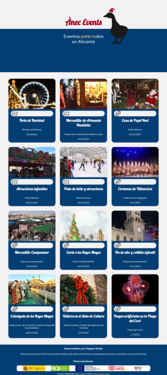

# Anec Events

Anec Events es una web de información para eventos culturales en la provincia de Alicante
creado por Dapper Drake, un equipo formado aleatoriamente en .

## Tabla de contenidos

- [Vista general](#vista-general)
  - [Escritorio](#escritorio)
  - [Desarrollo](#desarrollo)
  - [Maquetado con](#maquetado-con)
- [Autores](#autores)
## Vista General
### Escritorio

### Movil

### Links
- Live Site URL : [Anec events](https://anecevents.com)
## Desarrollo
### Maquetado con :
- Semantic HTML5 markup
- CSS custom properties
- Flexbox
- CSS Grid

## Autores
Dapper Drake es un grupo de 5 integrantes formado al azar en el curso de Programacion y Front-End en la Escuela de Organización Industrial.
Todo esto para simular de la mejor manera posible estar en un ambiente de trabajo, en el que no se eligen a los compañeros de equipo.

- [Gema Martín](https://github.com/geminway92)
- [Sofía Rojas](https://github.com/RoseGafe)
- [Tamara Kadyear](https://github.com/TKadyear)
- [Lucía Ruiz](https://github.com/Lulurm22)
- [David Álvarez](https://github.com/deivizzzZ)

