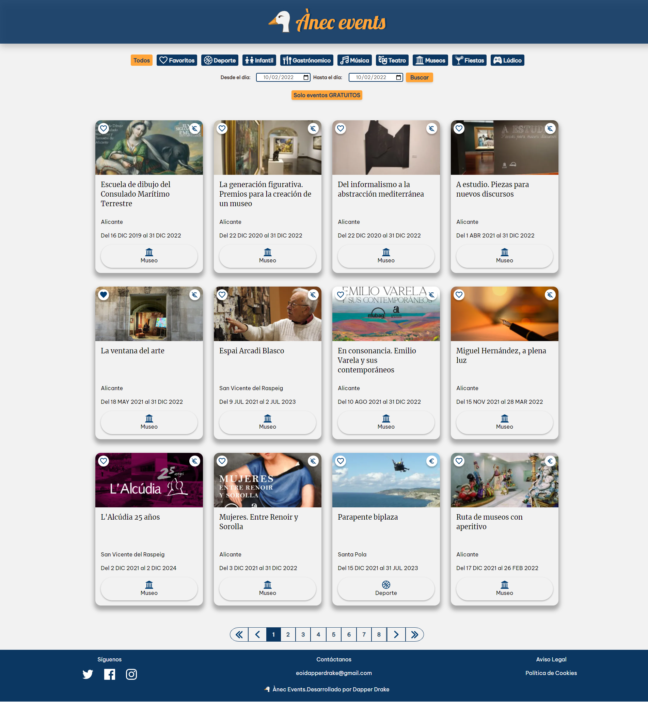
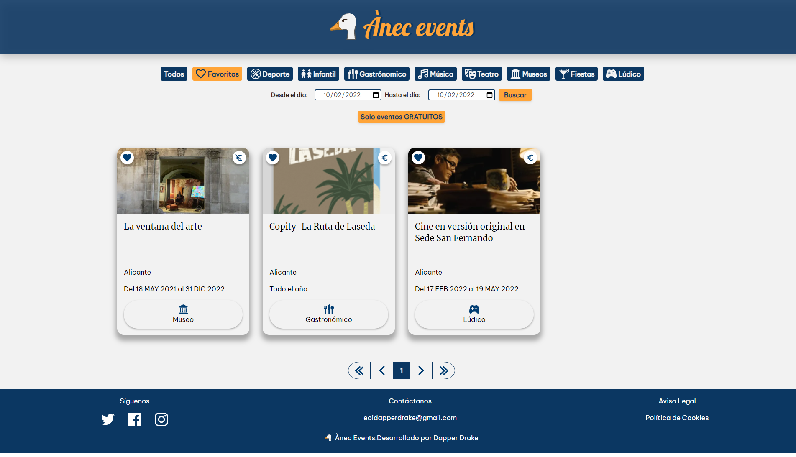
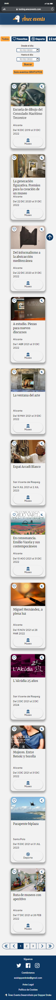
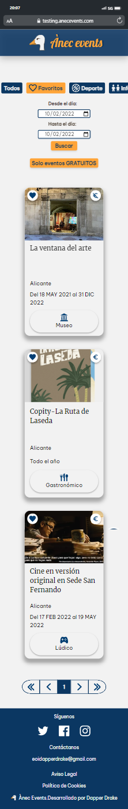

# Anec Events

Ante la problemática de encontrar información detallada sobre los eventos que se realizan en la provincia de Alicante surge Ànec Events, una web que recoge y categoriza estas actividades de una forma accesible y fácil de utilizar. En ella podrás acceder a información sobre distintos tipos de eventos, filtrarlos según tus interese y guardar como favoritos aquellas actividades que llamen tu atención.

Este proyecto nace como una práctica grupal de los alumnos del grupo Dapper Drake, pertenecientes al Curso de Programación y Desarrollo Front-End de la Escuela de Organización Industrial (EOI), con el objetivo de desarrollar sus conocimientos sobre la materia a la vez que ofrecen un servicio de utilidad.

## Tabla de contenidos

- [Vista general](#vista-general)
  - [Enlace a la web](#enlace-a-la-web)
  - [Capturas en ordenador](#capturas-en-ordenador)
  - [Capturas en móvil](#capturas-en-móvil)
- [Desarrollo](#desarrollo)
  - [Tecnologías](#tecnologías)
  - [Reproducir en local](#reproducir-en-local)
  - [Storybook](#storybook)
- [Documentación](#documentación)
- [Autores](#autores)
## Vista General
### Enlace a la web
Descubre Ànec Events web en:
https://www.app.anecevents.com/

Ànec Events cuenta también con una [Landing Page](https://github.com/drapper-drake/landing_anec) que puedes encontrar en:
https://www.anecevents.com/

### Capturas en ordenador


Y captura en ordenador de eventos en favoritos:

### Capturas en móvil


Y captura en móvil de favoritos:

## Desarrollo
### Tecnologías
- Maquetación: HTML5
- Estilos: Tailwind CSS
- Funcionalidad: VueJS, Vue Router y VueX
- Empaquetador: Vite
- Test y documentación extra: Jest y Storybook

### Reproducir en local
Clona el proyecto
```
  git clone https://github.com/drapper-drake/anec_events
```
Entra en la carpeta
```
  cd anec_events
```
Instala las dependencias del proyecto
```
  npm install
```
Construye el proyecto con vite
```
  npm run build
```
Inicia el proyecto en local
```
  npm run dev
```

### Storybook
Con el objetivo de poder probar variaciones en los diseños de componentes, se ha realizado un storybook recopilandolos.
Ahora mismo tenemos el storybook público en Chromatic, por lo que se puede consultar fácilmente entrando [aquí](https://62025d49ccb1b0003a97a2b8-ytyfysbihy.chromatic.com/?path=/story/anecevents).

También se puede acceder al Storybook de forma local, para ello sólo hace falta seguir las indicaciones de [reproducir en local](#reproducir-en-local) y escribir en una terminal del proyecto:
```
npm run storybook
```


## Documentación
Ànec Events ha desarrollado una documentación extensa para facilitar el entendimiento de la web. Desde [aquí](https://github.com/drapper-drake/anec_events/tree/develop/docs) puedes acceder a ella.
## Autores
Los autores de este proyecto son el grupo Dapper Drake, alumnos del Curso de Programación y Desarrollo Web Front-End de la Escuela de Organización Industrial (EOI).
El equipo consta de cinco integrantes que fueron elegidos aleatoriamente, con el objetivo de simular un ambiente de trabajo en el que no puedes elegir a tus compañeros.


- [Gema Martín](https://github.com/geminway92)
- [Sofía Rojas](https://github.com/RoseGafe)
- [Tamara Kadyear](https://github.com/TKadyear)
- [Lucía Ruiz](https://github.com/Lulurm22)
- [David Álvarez](https://github.com/deivizzzZ)


